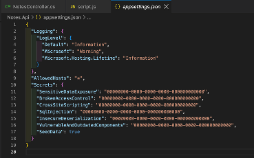
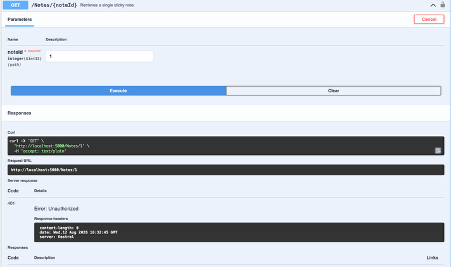
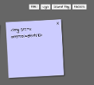
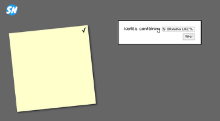
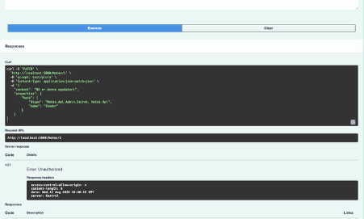
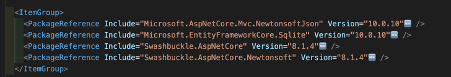

Reflektion säkerhetsövning StickyNotes
Tankar efter att ha fixat de sex sårbarheterna.
 
1. Sensitive Data Exposure
Vad jag lärde mig: Att man aldrig ska lägga lösenord i koden man checkar in. Jag flyttade det till en fil som git ignorerar i stället.
Risker: Alla som kommer åt repot kan läsa lösenordet, och är det publikt ligger det ute på nätet direkt. Folk letar efter läckta lösenord på GitHub och testar dem mot andra tjänster.
Förebyggande: Håll hemligheter utanför koden, typ i miljövariabler eller user secrets. En grej jag tar med mig är att det inte räcker att ta bort ett lösenord som redan läckt. Det ligger kvar i historiken så man måste byta det.

 

 
2. Broken Access Control
Vad jag lärde mig: Att bara för att någon är inloggad så betyder det inte att de får göra allt. Man måste kolla att de faktiskt äger grejen de vill ändra. Jag la till en koll på det innan en anteckning ändras.
Risker: Utan kollen kunde vem som helst ändra andras anteckningar bara genom att gissa ett id. I en riktig app kan det betyda att man kommer åt eller ändrar andras data.
Förebyggande: Gör alltid koll på servern och lita aldrig på klienten. Kolla behörighet vid varje operation, inte bara vid inloggningen.

 
 
3. Cross Site Scripting (XSS)
Vad jag lärde mig: Att skillnaden mellan innerHTML och innerText faktiskt är en säkerhetsgrej. innerHTML kör HTML och skript medan innerText bara visar texten.
Risker: Någon kan lägga in script i en anteckning som sen körs i andras webbläsare. Typ för att stjäla sessioner eller göra saker i användarens namn.
Förebyggande: Behandla allt som användare skriver som text och inte kod. Håll dig borta från innerHTML när det är data man inte litar på.

 
 
4. SQL Injection
Vad jag lärde mig: Att bygga SQL genom att klistra ihop strängar med användarens input är farligt, och att en ORM som Entity Framework fixar det åt en med parametriserade frågor.
Risker: Med rätt input kunde jag bryta mig ur frågan och läsa allas anteckningar. I värsta fall kan man läsa, ändra eller radera hela databasen.
Förebyggande: Använd alltid parametriserade frågor eller en ORM. Blanda aldrig in data direkt i SQL-strängen.

 
 
5. Insecure Deserialization
Vad jag lärde mig: Att en inställning i ett bibliotek kan vara en säkerhetsrisk i sig. TypeNameHandling.Auto lät inkommande data bestämma vilken klass som skapas, så jag ändrade till None.
Risker: En angripare kan få servern att skapa objekt av vilka typer som helst, och i värsta fall köra egen kod på servern.
Förebyggande: Låt bara servern skapa de typer man faktiskt väntar sig och lita inte på data utifrån.

 
6. Vulnerable and Outdated Components
Vad jag lärde mig: Att man måste kolla exakt vilka paket man installerar. Här fanns felstavade fejkpaket (Swashbukle utan c) med skadlig kod, alltså ett typosquatting-angrepp. Jag bytte till de äkta paketen.
Risker: Ett fejk eller sårbart paket kör kod i din app med full åtkomst. Som Log4Shell visade kan en enda dålig dependency drabba jättemånga.
Förebyggande: Dubbelkolla paketnamn och vem som gett ut det, håll beroenden uppdaterade och kör automatisk skanning som Dependabot. Och stäng inte av sårbarhetsvarningar, de finns av en anledning.

 
 
Övergripande lärdom: Det mesta handlar egentligen om samma sak. Lita aldrig på data utifrån och gör säkerhetsbesluten på servern. Flera av bristerna var dessutom bara en enda rad kod, vilket visar hur små misstag kan bli stora problem.
